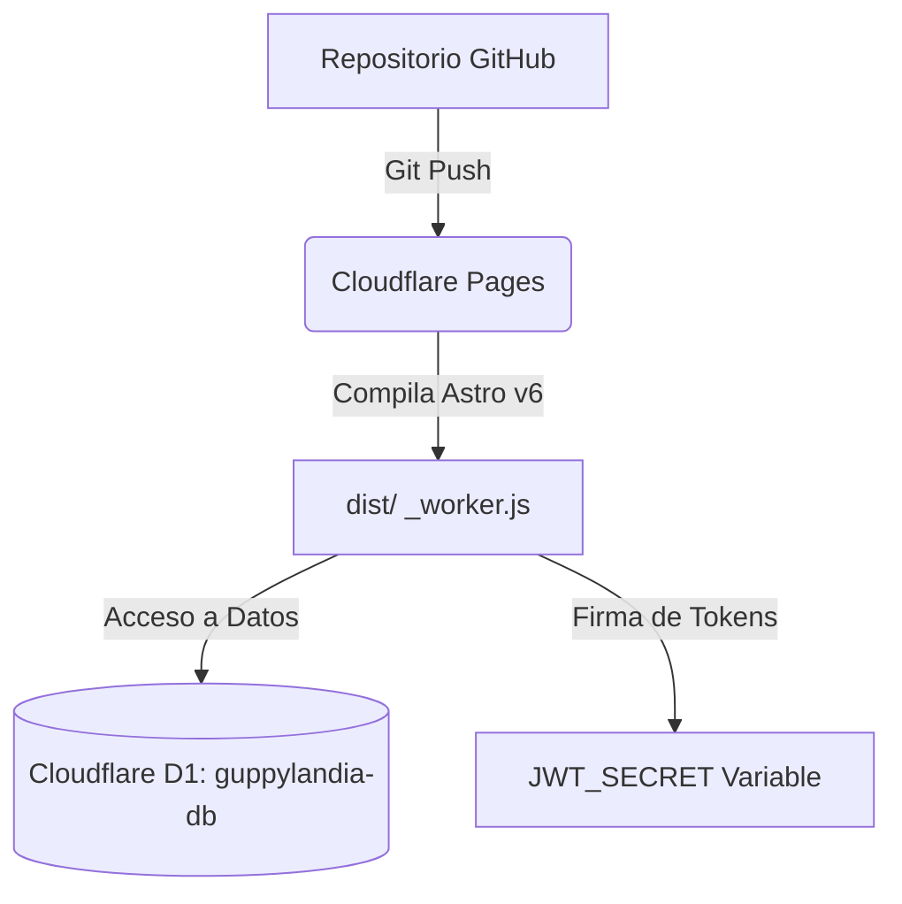

# 🌊 Guía de Despliegue en Cloudflare Pages - GuppyLandia 🐠

¡Hola! Como tu mentor, he analizado a fondo el proyecto y verificado que **está 100% preparado para producción**. La configuración de Astro v6 con el adaptador `@astrojs/cloudflare` es correcta y la compilación local se completa con éxito (`exit code: 0`).

Dado que tu proyecto utiliza **SSR (Server-Side Rendering)** y una **base de datos D1 (SQLite nativa en Cloudflare)** para gestionar el catálogo y el panel de administración, el despliegue requiere sincronizar la base de datos en la nube y vincularla a tu aplicación de Cloudflare Pages.

A continuación, te presento el paso a paso detallado para realizar el despliegue con éxito.

---

## 📋 Arquitectura del Despliegue



---

## 🛠️ Fase 1: Creación y Migración de la Base de Datos D1

Astro y Wrangler se comunican con Cloudflare para administrar tu base de datos D1. Vamos a crear la base de datos real en tu cuenta y aplicar las tablas de la migración inicial.

### Paso 1.1: Crear la base de datos en Cloudflare
Tienes dos opciones para crearla. Te recomiendo usar la **terminal** porque es más directa:

1. Abre tu terminal en la carpeta del proyecto `GuppyLandia`.
2. Ejecuta el siguiente comando para crear la base de datos en tu cuenta de Cloudflare:
   ```bash
   npx wrangler d1 create guppylandia-db
   ```
3. La terminal te pedirá iniciar sesión en tu cuenta de Cloudflare si no lo has hecho antes.
4. Una vez creada, la terminal te devolverá un mensaje con una configuración como esta:
   ```toml
   [[d1_databases]]
   binding = "DB"
   database_name = "guppylandia-db"
   database_id = "tu-uuid-de-base-de-datos-aqui"
   ```

> [!NOTE]
> También puedes crearla desde el Dashboard de Cloudflare en la sección **Workers & Pages ➔ D1 ➔ Create database**.

### Paso 1.2: Configurar tu archivo `wrangler.toml`
Abre tu archivo [wrangler.toml](file:///c:/Users/jorda/Desktop/GuppyLandia/wrangler.toml) y reemplaza la línea `database_id = "local"` con el ID real que te dio Cloudflare:

```toml
name = "guppylandia"
compatibility_date = "2025-01-01"

[[d1_databases]]
binding = "DB"
database_name = "guppylandia-db"
database_id = "COPIA_AQUÍ_EL_UUID_QUE_TE_DIO_CLOUDFLARE"
```

### Paso 1.3: Ejecutar las migraciones en Producción (Remoto)
Para crear las tablas `productos` y `admin_config`, e insertar los productos semilla en la base de datos de producción, ejecuta el siguiente comando:

```bash
npx wrangler d1 execute guppylandia-db --remote --file=migrations/0001_init.sql
```

> [!IMPORTANT]
> El flag `--remote` le indica a Wrangler que ejecute el archivo SQL en el servidor real de Cloudflare, no en el entorno de desarrollo local. ¡Con esto tu base de datos en producción ya tendrá todos los guppys, plantas y acondicionadores listos!

---

## 🚀 Fase 2: Conexión con GitHub y Despliegue en Cloudflare Pages

Dado que tu proyecto local ya está enlazado a tu repositorio en GitHub ([https://github.com/jordanrevelo214-creator/Pagina-Web-Guppylandia.git](https://github.com/jordanrevelo214-creator/Pagina-Web-Guppylandia.git)) y al día con `origin/main`, el proceso es extremadamente sencillo.

### Paso 2.1: Sube los cambios de `wrangler.toml` a GitHub
Como modificaste el `wrangler.toml` con tu `database_id` real, debes subir ese cambio a GitHub:

```bash
git add wrangler.toml
git commit -m "config: vincular base de datos D1 de producción"
git push origin main
```

### Paso 2.2: Crear el Proyecto en Cloudflare Pages
1. Inicia sesión en el [Dashboard de Cloudflare](https://dash.cloudflare.com/).
2. En la barra lateral izquierda, haz clic en **Workers & Pages**.
3. Haz clic en el botón azul **Create** y luego selecciona la pestaña **Pages** en la parte superior.
4. Selecciona **Connect to Git**.
5. Selecciona tu cuenta de GitHub y busca tu repositorio: `Pagina-Web-Guppylandia`.
6. Haz clic en **Begin setup**.

### Paso 2.3: Configuración de Compilación (Build Settings)
Cloudflare Pages detectará automáticamente que es un proyecto de Astro, pero asegúrate de que los campos coincidan con los siguientes valores:

| Campo | Valor |
| :--- | :--- |
| **Project Name** | `guppylandia` |
| **Production Branch** | `main` |
| **Framework Preset** | `Astro` |
| **Build Command** | `npm run build` |
| **Build Output Directory** | `dist` |

#### Configurar la Versión de Node.js (¡MUY IMPORTANTE!)
Tu proyecto requiere Node.js `>=22.12.0`. Para asegurarte de que Cloudflare compile usando la versión correcta:
1. En esa misma pantalla de configuración, despliega la sección **Environment variables (advanced)**.
2. Añade la siguiente variable:
   - **Variable Name:** `NODE_VERSION`
   - **Value:** `22.12.0`
3. Haz clic en **Save and Deploy**.

> [!TIP]
> La primera compilación podría fallar o quedar incompleta si todavía no hemos configurado los bindings y secretos. No te preocupes, esto es normal. Pasemos a configurarlos en la siguiente fase.

---

## 🔒 Fase 3: Vincular D1 y Configurar Secretos (Variables de Entorno)

Una vez creado el proyecto en Cloudflare Pages, debemos darle acceso a la Base de Datos D1 y configurar la clave secreta para la generación de tokens JWT de administrador.

### Paso 3.1: Vincular la Base de Datos D1
1. En el Dashboard de tu proyecto en Cloudflare Pages, ve a la pestaña superior **Settings** (Configuración).
2. En la barra lateral izquierda de los ajustes, selecciona **Functions** (Funciones).
3. Baja hasta la sección **D1 database bindings**.
4. Haz clic en **Add binding**.
5. Rellena los campos con los siguientes valores:
   - **Environment:** Selecciona **tanto Production como Preview** (deberás agregarlo para ambos entornos).
   - **Variable name (Binding):** `DB` *(Debe ser exactamente `DB`, en mayúsculas, ya que en el código Astro lo lee como `env.DB`)*.
   - **D1 Database:** Selecciona tu base de datos `guppylandia-db` de la lista desplegable.
6. Haz clic en **Save** (Guardar).

---

### Paso 3.2: Configurar la variable secreta `JWT_SECRET`
Tu backend utiliza una clave secreta para firmar los tokens JWT del panel de administrador.
1. En la pestaña **Settings** (Configuración) de tu proyecto de Pages, selecciona **Environment variables** en el menú izquierdo.
2. Haz clic en **Add variables** (o *Edit variables*).
3. Añade la variable que tienes en tu `.env` local:
   - **Variable name:** `JWT_SECRET`
   - **Value:** *Introduce una clave muy segura y larga (puedes usar la misma de tu `.env` o una nueva)*.
   - **Encrypt/Secret:** Asegúrate de marcarla como secreta para que nadie pueda verla.
4. Haz clic en **Save** (Guardar).

---

## 🔄 Fase 4: Re-desplegar y Validar

Una vez que has configurado los **D1 bindings** y las **Variables de entorno**, debemos volver a compilar para que Cloudflare Pages aplique estos recursos:

1. Ve a la pestaña **Deployments** (Despliegues) de tu proyecto de Pages.
2. Busca tu último despliegue (o el primero que falló) y haz clic en los tres puntos a la derecha o entra en él.
3. Haz clic en **Retry deployment** (Reintentar despliegue) o realiza un pequeño cambio y haz un `git push` a tu rama `main` para disparar una build automática.
4. Espera a que termine la compilación. Verás un mensaje de éxito: **"Success! Your site is live"** junto con una URL pública gratuita (ejemplo: `https://guppylandia.pages.dev`).

### ✅ Lista de Verificación de Funcionamiento
Una vez desplegado, realiza estas pruebas rápidas para asegurarte de que todo funciona de forma impecable:
* [ ] **Carga del catálogo:** Entra a la página de inicio o a la tienda y verifica que carguen los peces, plantas y acondicionadores que importamos mediante la migración SQL.
* [ ] **Panel de Administración:** Ve a `/admin` o la ruta de acceso de administrador de tu web e inicia sesión con la contraseña por defecto (`guppylandia2026`).
* [ ] **Prueba de Creación:** Agrega un pez o planta de prueba para verificar que la escritura en D1 funciona.
* [ ] **Seguridad:** Cambia la contraseña por defecto en el panel para asegurar tu tienda de accesos no autorizados en producción.

---

¡Excelente trabajo! Tienes una arquitectura web de altísimo nivel, extremadamente rápida gracias al Edge de Cloudflare, segura mediante JWT y con base de datos nativa D1 sin coste alguno.

¿Tienes alguna duda sobre alguno de los pasos o quieres que verifiquemos algún comando juntos antes de que inicies? ¡Aquí estoy para ayudarte! 🚀🐠
